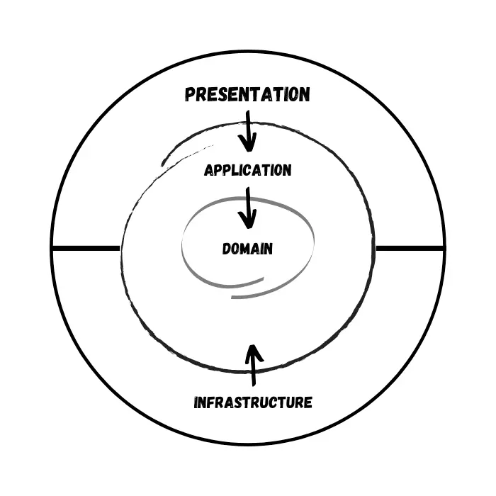

# Onion Architecture In ASP.NET Core

- **Domain and Application Layer** will be at the center of the design. We can refer to these layers as the Core Layers. These layers will not depend on any other layers.
- **The presentation layer** is where you would Ideally want to put the Project that the User can Access. This can be a WebApi, Mvc Project, etc.
- **The infrastructure layer** is where you would want to add your Infrastructure. Infrastructure can be anything. Maybe an Entity Framework Core Layer for Accessing the DB, a Layer specifically made to generate JWT Tokens for Authentication or even a Hangfire Layer.

## Advantages of Onion Architecture
- **Highly Testable** – Since the Core has no dependencies on anything else, writing automated tests are flexible,
- **Database Independent** – Since we have a clean separation of data access, it is quite easy to switch between different database providers.
- **Switchable UI Layer (Presentation)** – Since we are keeping all the crucial logic away from the presentation layer, it is quite easy to switch to another tech – including Blazor.
- **Much Cleaner Codebase** with well-structured Projects for better understanding with teams.

## List of features and tech
- Onion Architecture
- Entity Framework Core
- .NET Core 8.0
- Swagger
- CQRS / Mediator Pattern using MediatR Library
- Wrapper Class for Responses
- CRUD Operations
- Inverted Dependencies
- API Versioning
- TODOs
  - Pagination & Response Wrappers
  - JWT Authentication in API – With Refresh Tokens.
  - Error Logging with Serilog
  - Background Job Processing with Hangfire

### Migration commands
> - Init migration: `dotnet ef --startup-project ../WebApi migrations add InitialCreate`
> - Applying Created Migration: `dotnet ef --startup-project ../WebApi database update`
> - Remove migration: `dotnet ef --startup-project ../WebApi migrations remove`
> - Drop database: `dotnet ef --startup-project ../WebApi database drop`

### API endpoints
- GET http://localhost:5262/api/v1.0/Product
- POST http://localhost:5262/api/v1.0/Produc
- PUT http://localhost:5262/api/v1.0/Product/{{id}}
- GET http://localhost:5262/api/v1.0/Product/{{id}}
- DELETE http://localhost:5262/api/v1.0/Product/{{id}}